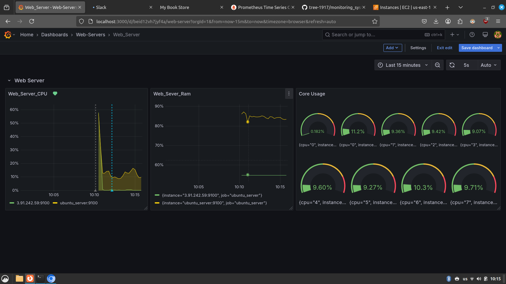
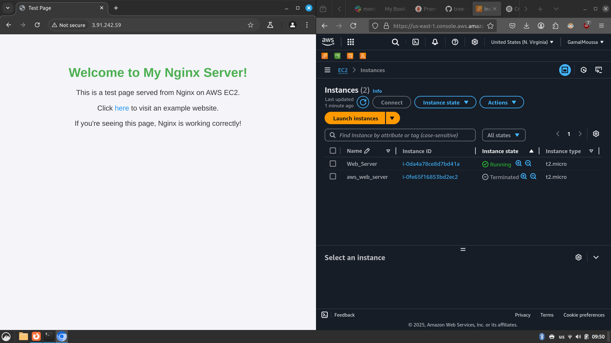
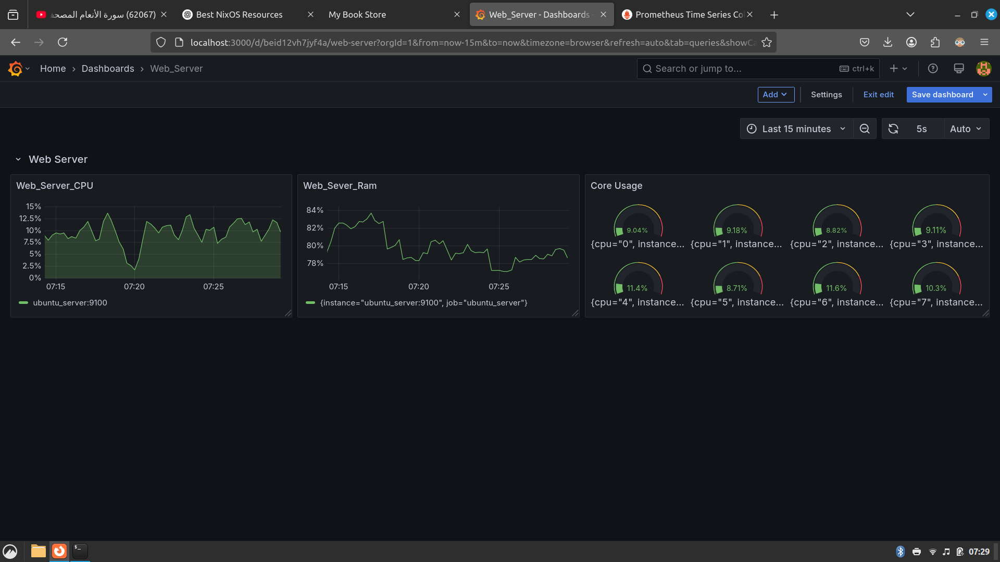
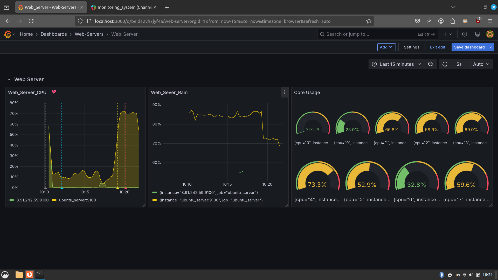
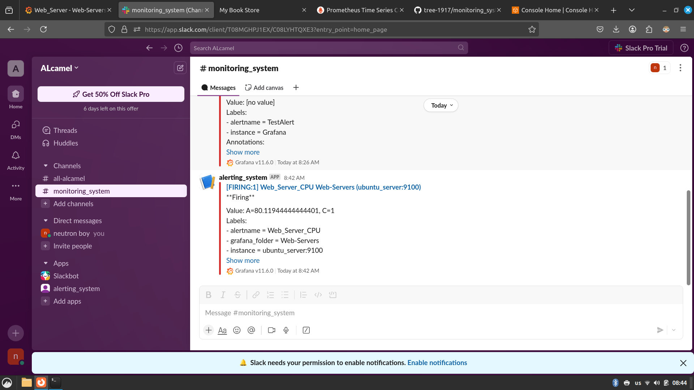
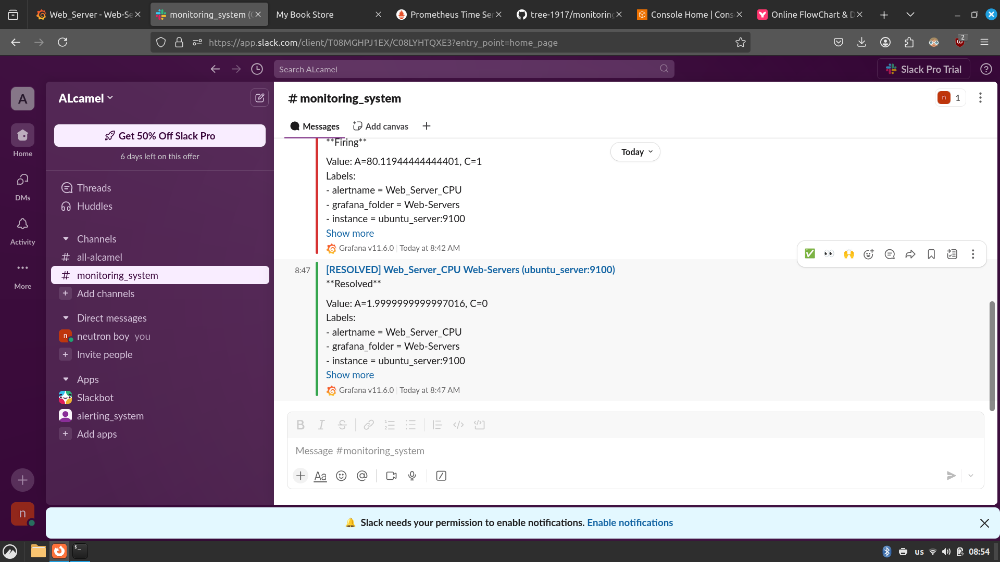

# 🌐 Monitoring Server: Unified Metrics & Alerts

**Monitoring Server** is a powerful and flexible monitoring stack designed to oversee both **local** and **cloud-based servers** from a **single dashboard**. Built using **Prometheus**, **Grafana**, and **Slack**, it enables real-time metrics visualization, smart alerting, and seamless containerized deployment via **Docker Compose**.

---

## 🚀 Key Highlights

✅ Monitor multiple servers (local and EC2/cloud)  
✅ Customizable alerting rules  
✅ Slack integration for instant alerts (firing/resolved)  
✅ Visualize all server metrics in Grafana dashboards  
✅ Easy deployment using Docker Compose  
✅ Lightweight and modular setup  
✅ NTFS support for additional mounted storage  

---

## 🧰 Tech Stack

- **Prometheus** – Metrics collection and alerting
- **Grafana** – Dashboarding and visualization
- **Node Exporter** – System-level metrics exporter
- **Slack Webhook** – Alert delivery and incident response
- **Docker & Docker Compose** – Container management
- **EC2** – Cloud-based monitoring deployment

---

## 🗂️ Project Structure

```
Monitoring_Server/
├── docker-compose.yml          # Deploys Prometheus & Grafana stack
├── prom_server/                # Prometheus config (prometheus.yml, alert rules)
├── ubuntu_server/              # Local server configs for exporters
├── ScreenShots/                # Project screenshots & alert examples
└── Readme.md                   # You're here
```

---

## 📸 Visual Overview

### EC2 Instance Running the Monitoring Server


### Grafana Dashboard Access via Browser


### Local Ubuntu Server Being Monitored


### Website View for Ubuntu Server Data


### Final Grafana Dashboard Result


### Firing Alert from Grafana


### Slack Alert: Firing Notification


### Slack Alert: Resolved Notification


### Ubuntu Server Connected to Monitoring System


---

## ⚙️ How It Works

1. **Prometheus** collects metrics from configured local and cloud servers.
2. **Grafana** queries Prometheus and displays the metrics.
3. Alert rules in `prometheus.yml` trigger based on thresholds.
4. Alerts are sent to **Slack** using a webhook.
5. Everything is containerized for simple deployment and scaling.

---

## 🛠️ Setup Guide

1. Clone the repository:
   ```
   git clone https://github.com/tree-1917/Monitoring_Server.git
   cd Monitoring_Server
   ```

2. Start the monitoring stack:
   ```
   docker-compose up -d
   ```

3. Access the dashboards:
   - **Grafana**: http://localhost:3000 (admin / admin)
   - **Prometheus**: http://localhost:9090

4. Connect local/cloud servers with Node Exporter:
   - Install exporter
   - Add target IP to `prometheus.yml`

5. Configure your **Slack webhook** inside the alertmanager configuration.

---

## 🧩 Future Improvements

- Add mobile alerts support (Telegram, Pushover)
- Integrate Loki for centralized log monitoring
- Dynamic server discovery and auto-target registration
- Terraform automation for cloud provisioning

---

## 🧑‍💻 Maintained by

**Gamal Moussa**  
📫 [tree-1917.github.io/tree-1917](https://tree-1917.github.io/tree-1917)

If you like this project, drop a ⭐ and contribute your ideas!

---
